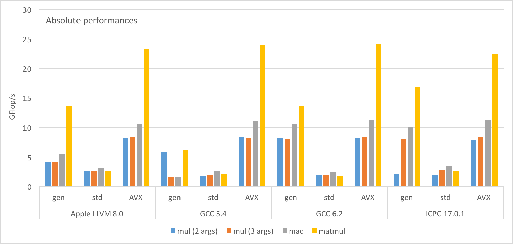
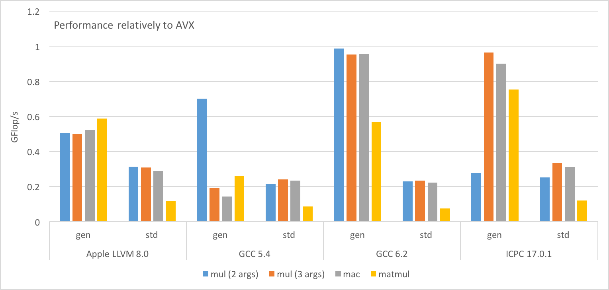

# Vectorisation study

Antonin Portelli, 7/12/2016

The code presented here is a minimal version of arithmetic operations in [Grid](https://github.com/paboyle/Grid), under GPL v2 license.

[toc]

## Setup
Large array of $N$ short vectors of size $w$ of complex numbers. We want to test compiler vectorisation on element-wise operations vs. intrinsic-based ASM code.

| Test function                       | Formula               | Code |
|-------------------------------------|-----------------------|------|
| Complex multiply                    | $a_i = b_i c_i$       | `a = mul(b,c)` (2 arg.) `mul(a,b,c)` (3 arg.)     |
| Complex accumulated multiply        | $a_i = a_i + b_i c_i$ | `mac(a,b,c)`    |
| $n\times n$ complex matrix multiply | $A_i = B_iC_i$        | `matmul(A,B,C)` |

Complex matrices are stored in an array of $n^2N$ short vectors, each matrix being a row-major ordered $n^2$ contiguous sequence in the large array. We use the following code for matrix multiplications:

``` cpp
for (unsigned int r = 0; r < nRow; ++r)
for (unsigned int s = 0; s < nRow; ++s)
{
  mul(a[os + r*nRow + s], b[os + r*nRow], c[os + s]);
}
for (unsigned int r = 0; r < nRow; ++r)
for (unsigned int t = 1; t < nRow; ++t)
for (unsigned int s = 0; s < nRow; ++s)
{
  mac(a[os + r*nRow + s], b[os + r*nRow + t], c[os + t*nRow + s]);
}
``` 

The flop count for the test functions goes as follows:

| Test function | Flops                 |
|---------------|-----------------------|
| `mul`         | $6wN$                 |
| `mac`         | $8wN$                 |
| `matmul`      | $N[6n^2w+8n^2(n-1)w]$ |

### Generic code
Here the short vectors are just C arrays of real numbers, a complex number being a contiguous set of 2 real numbers:

``` cpp
template <typename T> 
struct vec {
  alignas(w) T v[W<T>::r];
};
```

`T` is the real number type, `w` is the short vector width in bytes and `W<T>::r` is some type traits giving the number of elements in one short vector which is equivalent to `w/sizeof(T)`.

Operations are naively implemented by looping over the components of a vector. For example, the function `mul` (3 arguments version) is given by:

``` cpp
#define cmul(a, b, c, i)\
a[i]   = b[i]*c[i]   - b[i+1]*c[i+1];\
a[i+1] = b[i]*c[i+1] + b[i+1]*c[i];

template <typename T>
strong_inline void mul(vec<T> &a, const vec<T> &b, const vec<T> &c)
{
  for(unsigned int i = 0, i < W<T>::c, ++i)
  {
    cmul(a.v, b.v, c.v, 2*i);
  }      
}
```

where `W<T>::c` is the number of complex numbers in a vector (so `W<T>::r/2`).

### Standard library code
This is also a "naive" code, but here complex numbers are implemented by using the `std::complex` type:

``` cpp
template <typename T>
struct vecc {
  alignas(w) std::complex<T> v[W<T>::c];
};
```

Operations are also just loop over components, but now operators from the `std::complex` class are used:

``` cpp
template <typename T>
strong_inline void mul(vecc<T> &a, const vecc<T> &b, const vecc<T> &c)
{
  for(unsigned int i = 0, i < W<T>::c, ++i)
  {
    a.v[i] = b.v[i]*c.v[i];
  }
}
```

### Intrinsic-based ASM code
This is of course totally architecture dependent. We show as an example the AVX + FMA code used in benchmarks. In that case the vector type is `__m256` and `mult` and `mac` are implemented as follows:

``` cpp
#define SELECT(A,B,C,D) ((A<<6)|(B<<4)|(C<<2)|(D))

__m256 mul(const __m256 &a, const __m256 &b)
{
  __m256 a_real = _mm256_moveldup_ps(a);
  __m256 a_imag = _mm256_movehdup_ps(a);

  a_imag = _mm256_mul_ps(a_imag, _mm256_shuffle_ps(b, b, SELECT(2,3,0,1)));

  return _mm256_fmaddsub_ps(a_real, b, a_imag);
}
```

## Benchmark
The following benchmark has been performed using one thread on a Intel Core i7-4850HQ CPU
 (peak: 37-56 GFlop/s/core). We used $N=10000$, $w=4$ (256 bits vectors) and $n=3$. With these parameters all arrays are fitting in the CPU cache. We used 4 different compilers: Apple LLVM 8.0, GCC 5.4 and 6.2, and Intel C++ compiler 17.0.1. All compilers were used with the flags `-O3 -march=native -mtune=native`.
 
Results of the benchmark are given below:



We draw the following conclusions:

1. Using intrinsics gives stable performances over all compilers.
2. Using `std::complex` is really bad independently of the compiler.
3. LLVM and GCC 5.4 are doing quite poorly with vectorising the generic code.
4. For both GCC 6.2 and the Intel compiler, generic `mul` (3 args.) and `mac` operations perform essentailly as well as the intrinsic code! However, although matrix multiplication is just `mul` and `mac` loops, the intrinsic code is better.
5. The 2 and 3 arguments versions of `mul` are the same up to a return value optimisation (RVO). However, GCC 5.4 has very poor performances in the 2 argument case and the opposite happens for the Intel compiler.

## Forensics
### Intrinsic-based AVX+FMA code
#### Apple LLVM 8.0
Let us start by the main code in the `cmul` function:

``` nasm
; Kernel of mul (2&3 arguments)
vmovaps ymm0, ymmword [rsi + rax]
vmovsldup ymm1, ymm0
vmovshdup ymm0, ymm0
vmovaps ymm2, ymmword [rsi + rcx]
vpermilps ymm3, ymm2, 0xb1
vmulps ymm0, ymm0, ymm3
vfmaddsub213ps ymm1, ymm2, ymm0
vmovaps ymmword [rsi + rdx], ymm1
```

Nothing much to say, the instructions follow closely the intrinsics sequence and RVO has been applied to the 2 arguments function. Exactly the same thing can be said for `mac`:

``` nasm
; Kernel of mac
vmovaps ymm0, ymmword [rsi + rax]
vmovsldup ymm1, ymm0
vmovshdup ymm0, ymm0
vmovaps ymm2, ymmword [rsi + rcx]
vpermilps ymm3, ymm2, 0xb1
vmulps ymm0, ymm0, ymm3
vfmaddsub213ps ymm1, ymm2, ymm0
vaddps ymm0, ymm1, ymmword [rsi + rdx]
vmovaps ymmword [rsi + rdx], ymm0
```

For `matmul` the kernel is 141 instruction longs. The index loops have been fully unrolled. There is nothing really interesting to show, except maybe that sometimes the compiler have been optimising the code by reusing registers and reducing the number of permutes.

#### GCC 5.4
```nasm
; Kernel of mul (2&3 arguments)
vmovaps ymm0, ymmword [rsi + rax]
vmovaps ymm1, ymmword [rcx + rax]
vmovsldup ymm2, ymm0
vmovshdup ymm0, ymm0
vshufps ymm3, ymm1, ymm1, 0xb1
vmulps ymm0, ymm0, ymm3
vfmaddsub231ps ymm0, ymm2, ymm1
vmovaps ymmword [rdx + rax], ymm0
```

The kernel of `mul` is pretty much identical to the LLVM case, the only difference is the use of `vshufps` instead of `vpermilps` which does not make any difference. The `mac` code is very similar.

The `matmul` code is very mixed up and one cannot identify easily the `mul` & `mac` sequence like in LLVM's case. However it is possible to count 27 complex multiply shwing that the loops are completely unrolled. The sequence is 144 instructions long, the 3 additional instructions compared to LLVM are integer arithmetic.

#### GCC 6.2
GCC 6.2 generates essentially the same code as GCC 5.4. The only visible difference is the `matmul` sequence which is 141 instructions long like in LLVM's case.

#### Intel C++ compiler 17.0.1
``` nasm
; Kernel of mul (2&3 arguments)
vmovups ymm2, ymmword [rdx + r10]
vmovshdup ymm0, ymmword [rcx + r10]
vshufps ymm1, ymm2, ymm2, 0xb1
vmulps ymm3, ymm0, ymm1
vmovsldup ymm4, ymmword [rcx + r10]
vfmaddsub213ps ymm4, ymm2, ymm3
vmovups ymmword [rax + r10], ymm4
```

Similarly to the other compilers, RVO worked. However there are noticeable differences in the loading instructions. The sequence is one instruction less than in the previous cases, one load being done directly with `vmovshdup`. Another difference is the fact that the Intel compiler does not use aligned load/store instruction. It does not like the perfoemance have been impacted by this.

The `matmul` sequence is quite different from the previous compilers. One of the loop is not unrolled (the outer `mac` loop) and there is quite some integer arithmetic:

``` nasm
; Kernel of matmul
...
vshufps ymm5, ymm9, ymm9, 0xb1
lea eax, [r9 + 5]          ; 0x5
shl rax, 5
vmovups ymmword [r8 + rax], ymm0
vmovups ymm8, ymmword [rax + rsi]
vshufps ymm2, ymm8, ymm8, 0xb1
lea eax, [r9 + 6]          ; 0x6
shl rax, 5
vmovshdup ymm3, ymmword [r15 + rax]
vmulps ymm11, ymm3, ymm11
vmulps ymm13, ymm3, ymm13
vmulps ymm3, ymm3, ymm4
vmovsldup ymm0, ymmword [r15 + rax]
vfmaddsub231ps ymm11, ymm7, ymm0
vmovups ymm7, ymmword [rax + rsi]
vfmaddsub231ps ymm13, ymm12, ymm0
vfmaddsub213ps ymm0, ymm6, ymm3
vmovups ymmword [r8 + rax], ymm11
vshufps ymm3, ymm7, ymm7, 0xb1
lea eax, [r9 + 7]          ; 0x7
shl rax, 5
vmovups ymmword [r8 + rax], ymm13
...
```

All the load/store instructions are also unaligned. The amount of integer arithmetic might explain the slightly lower performances. The LLVM code did not contain any integer instruction.

### Generic code
#### Apple LLVM 8.0
``` nasm
; Kernel of mul (2&3 arguments)
vmovaps ymm0, ymmword [rsi + rcx]
vpermilps ymm1, ymm0, 0xb1
vmovss xmm2, dword [rsi + rax + 0x1c]
vmovss xmm3, dword [rsi + rax + 0x14]
vinsertps xmm3, xmm3, xmm3, 0x10
vinsertps xmm3, xmm3, xmm2, 0x20
vinsertps xmm2, xmm3, xmm2, 0x30
vmovss xmm3, dword [rsi + rax + 0xc]
vmovss xmm4, dword [rsi + rax]
vmovss xmm5, dword [rsi + rax + 4]
vinsertps xmm5, xmm5, xmm5, 0x10
vinsertps xmm5, xmm5, xmm3, 0x20
vinsertps xmm3, xmm5, xmm3, 0x30
vinsertf128 ymm2, ymm3, xmm2, 1
vmulps ymm1, ymm1, ymm2
vmovss xmm2, dword [rsi + rax + 0x18]
vmovss xmm3, dword [rsi + rax + 0x10]
vinsertps xmm3, xmm3, xmm3, 0x10
vinsertps xmm3, xmm3, xmm2, 0x20
vinsertps xmm2, xmm3, xmm2, 0x30
vmovss xmm3, dword [rsi + rax + 8]
vinsertps xmm4, xmm4, xmm4, 0x10
vinsertps xmm4, xmm4, xmm3, 0x20
vinsertps xmm3, xmm4, xmm3, 0x30
vinsertf128 ymm2, ymm3, xmm2, 1
vmulps ymm0, ymm0, ymm2
vaddsubps ymm0, ymm0, ymm1
vmovaps ymmword [rsi + rdx], ymm0
```

Now that does not look so good. All the loads are scalar, probably because the compiler did not figure out that it can use move-shuffle loads and does the permutation by loading components one by one. One can also notice that the compiler missed the opportunity to use an FMA instruction at the end. The kernel of `mac` is very similar.

The kernel of `matmul` shows the same structure than above, in addition no loop have been unrolled.

#### GCC 5.4
``` nasm
; Kernel of mul (2 arguments)
vmovss xmm7, dword [rcx - 0x1c]
vmovss xmm14, dword [rdx - 0x1c]
vmovss xmm6, dword [rcx - 0x20]
vmulss xmm0, xmm14, xmm7
vmovss xmm13, dword [rdx - 0x18]
vmulss xmm7, xmm7, xmm15
vmovss xmm5, dword [rcx - 0x14]
vmovss xmm12, dword [rdx - 0x14]
vmovss xmm4, dword [rcx - 0x18]
vfmsub231ss xmm0, xmm15, xmm6
vmovss xmm11, dword [rdx - 0x10]
vmovss dword [rax - 0x20], xmm0
vfmadd132ss xmm6, xmm7, xmm14
vmovss dword [rax - 0x1c], xmm6
vmulss xmm6, xmm12, xmm5
vmovss xmm3, dword [rcx - 0xc]
vmulss xmm5, xmm5, xmm13
vmovss xmm10, dword [rdx - 0xc]
vmovss xmm2, dword [rcx - 0x10]
vmovss xmm9, dword [rdx - 8]
vfmsub231ss xmm6, xmm13, xmm4
vmovss xmm1, dword [rcx - 4]
vmovss dword [rax - 0x18], xmm6
vfmadd132ss xmm4, xmm5, xmm12
vmovss dword [rax - 0x14], xmm4
vmulss xmm4, xmm10, xmm3
vmovss xmm8, dword [rdx - 4]
vmulss xmm3, xmm3, xmm11
vmovaps xmm0, xmm8
vfmsub231ss xmm4, xmm11, xmm2
vmovss dword [rax - 0x10], xmm4
vfmadd132ss xmm2, xmm3, xmm10
vmovss dword [rax - 0xc], xmm2
vmulss xmm2, xmm8, xmm1
vfmsub231ss xmm2, xmm9, dword [rcx - 8]
vmulss xmm1, xmm1, xmm9
vmovss dword [rax - 8], xmm2
vfmadd132ss xmm0, xmm1, dword [rcx - 8]
vmovss dword [rax - 4], xmm0
```

The code is completely scalar and one can see the 4 complex products done one by one. The performances are not worse (if not better) than in LLVM's case where the floating-point arithmetic was vectorised. This probably indicates that the execution is dominated by the scalar loads in both cases. It is still hard to understand why the performances are so good.

The code generated for the 3 arguments version of `mul` is very messy:

``` nasm
; Kernel of mul (3 arguments)
vmovaps ymm0, ymmword [rcx]
add rax, 0x100
add rcx, 0x100
add rdx, 0x100
vmovaps ymm5, ymmword [rcx - 0xe0]
vmovaps ymm9, ymmword [rcx - 0xa0]
vmovaps ymm7, ymmword [rcx - 0x80]
vshufps ymm2, ymm0, ymm5, 0x88
vperm2f128 ymm1, ymm2, ymm2, 3
vshufps ymm6, ymm2, ymm1, 0x44
vmovaps ymm8, ymmword [rcx - 0x60]
vshufps ymm1, ymm2, ymm1, 0xee
... ; a LOT of shuffling between registers
vshufps ymm13, ymm4, ymm13, 0xee
vinsertf128 ymm13, ymm7, xmm13, 1
vmovaps ymm7, ymmword [rbp - 0x90]
vinsertf128 ymm5, ymm15, xmm5, 1
vmulps ymm4, ymm6, ymm12
vfmsub231ps ymm4, ymm1, ymm11
vmulps ymm1, ymm1, ymm12
vfmadd132ps ymm11, ymm1, ymm6
vmulps ymm1, ymm5, ymm10
vmovaps ymm6, ymmword [rbp - 0x70]
vfmsub231ps ymm1, ymm0, ymm9
vmulps ymm0, ymm0, ymm10
vfmadd132ps ymm9, ymm0, ymm5
vmulps ymm0, ymm14, ymm8
vfmsub231ps ymm0, ymm3, ymm7
vmulps ymm3, ymm3, ymm8
vfmadd132ps ymm14, ymm3, ymm7
vmovaps ymm7, ymmword [rbp - 0x50]
vmulps ymm8, ymm13, ymm7
vfmsub231ps ymm8, ymm2, ymm6
vmulps ymm2, ymm2, ymm7
vfmadd132ps ymm13, ymm2, ymm6
vunpcklps ymm2, ymm4, ymm0
vunpckhps ymm4, ymm4, ymm0
... ; a LOT of unpacking
vunpckhps ymm0, ymm1, ymm0
vinsertf128 ymm1, ymm2, xmm0, 1
vperm2f128 ymm0, ymm2, ymm0, 0x31
vmovaps ymmword [rdx - 0x40], ymm1
vmovaps ymmword [rdx - 0x20], ymm0
```

The total sequence is 337 instructions long for an operation which can be done with 8! It looks like the compiler tried to vectorised using separate `vfmadd` and `vfmsub`, and get mixed up with the real/imaginary part interleaving. This probably explains the huge amount of shuffling. As one can expect the performances are disastrous. The `mac` code is similar.

Maybe an explanation is that GCC 5.4 does not know how to generate `vfmaddsub`?

Finally, the `matmul` code is completely scalar and has a similar structure than the 2 arguments `mul`.

#### GCC 6.2
``` nasm
; Kernel of mul (2&3 arguments)
vmovaps ymm3, ymmword [rax]
vmovaps ymm1, ymmword [rcx]
vpermilps ymm4, ymm3, ymm8
vpermilps ymm2, ymm1, ymm7
vpermilps ymm3, ymm3, ymm5
vpermilps ymm1, ymm1, ymm6
vmulps ymm0, ymm1, ymm3
vmovaps ymm1, ymm2
vfmsub132ps ymm1, ymm0, ymm4
vfmadd231ps ymm0, ymm2, ymm4
vblendps ymm0, ymm1, ymm0, 0xaa
vmovaps ymmword [rdx], ymm0
```

This is a very good code, everything is vectorised cleanly although it looks like GCC is still struggling a bit to use `vfmaddsub` instructions. The `mac` code is as good.

Now what is surprising is that although GCC can vectorising almost perfectly individual `mul` and `mac` calls, the `matmul` code shows a lot of scalar load/store instructions like for GCC 5.4. This explains why generic matrix products do not perform as well as the AVX code.

#### Intel C++ compiler 17.0.1
``` nasm
; Kernel of mul (2 arguments)
vmovss xmm1, dword [rcx + r10 + 4]
vmovss xmm2, dword [rdx + r10]
vmulss xmm5, xmm1, xmm2
vmovss xmm3, dword [rdx + r10 + 4]
vmovss xmm9, dword [rdx + r10 + 0xc]
vmovss xmm4, dword [rcx + r10]
vmovss xmm7, dword [rcx + r10 + 0xc]
vmulss xmm0, xmm3, xmm1
vmulss xmm6, xmm9, xmm7
vfmadd231ss xmm5, xmm3, xmm4
vfmsub231ss xmm0, xmm2, xmm4
vmovss xmm10, dword [rcx + r10 + 8]
vmovss xmm8, dword [rdx + r10 + 8]
vmovss dword [rsp + 0xa4], xmm5
vmovss xmm15, dword [rdx + r10 + 0x14]
vfmsub231ss xmm6, xmm8, xmm10
vmovss xmm14, dword [rdx + r10 + 0x10]
vmovss xmm5, dword [rdx + r10 + 0x1c]
vmovss xmm4, dword [rdx + r10 + 0x18]
vmovss xmm13, dword [rcx + r10 + 0x14]
vmovss xmm3, dword [rcx + r10 + 0x1c]
vmulss xmm11, xmm7, xmm8
vmulss xmm12, xmm15, xmm13
vmulss xmm1, xmm13, xmm14
vmulss xmm2, xmm5, xmm3
vmulss xmm7, xmm3, xmm4
vfmadd231ss xmm11, xmm9, xmm10
vmovss dword [rsp + local_a0h], xmm0
vmovss dword [rsp + 0xa8], xmm6
vmovss xmm0, dword [rcx + r10 + 0x10]
vmovss xmm6, dword [rcx + r10 + 0x18]
vfmsub231ss xmm12, xmm14, xmm0
vfmadd231ss xmm1, xmm15, xmm0
vfmsub231ss xmm2, xmm4, xmm6
vfmadd231ss xmm7, xmm5, xmm6
vmovss dword [rsp + 0xac], xmm11
vmovss dword [rsp + 0xb0], xmm12
vmovss dword [rsp + 0xb4], xmm1
vmovss dword [rsp + local_b8h], xmm2
vmovss dword [rsp + 0xbc], xmm7
vmovups ymm8, ymmword [rsp + local_a0h]
vmovups ymmword [r10], ymm8
```

This is not good, the code is completelt scalar and similar to the one generated by GCC 5.4. However the 3 arguments version is very different:

``` nasm
; Kernel of mul (3 arguments)
lea r10d, [r8 + r8]
vmovups ymm0, ymmword [rdx + r10*4]
lea r11d, [r8 + r8 + 8]    ; 0x8
vmovups ymm4, ymmword [r9 + r10*4]
vmovups ymm1, ymmword [rdx + r11*4]
vmovups ymm5, ymmword [r9 + r11*4]
vperm2f128 ymm2, ymm0, ymm1, 0x20
lea r15d, [r8 + r8 + 0x10] ; 0x10
vperm2f128 ymm3, ymm0, ymm1, 0x31
vperm2f128 ymm6, ymm4, ymm5, 0x20
vperm2f128 ymm7, ymm4, ymm5, 0x31
vshufps ymm9, ymm2, ymm3, 0xdd
vshufps ymm8, ymm6, ymm7, 0x88
vshufps ymm10, ymm6, ymm7, 0xdd
vmulps ymm12, ymm9, ymm10
vmulps ymm11, ymm8, ymm9
vmovups ymm6, ymmword [r9 + r15*4]
vshufps ymm13, ymm2, ymm3, 0x88
vfmsub231ps ymm12, ymm8, ymm13
vfmadd213ps ymm13, ymm10, ymm11
vmovups ymm2, ymmword [rdx + r15*4]
vunpcklps ymm15, ymm12, ymm13
vunpckhps ymm0, ymm12, ymm13
vperm2f128 ymm14, ymm15, ymm0, 0x20
vmovups ymmword [rax + r10*4], ymm14
lea r10d, [r8 + r8 + 0x18] ; 0x18
vmovups ymm3, ymmword [rdx + r10*4]
vmovups ymm7, ymmword [r9 + r10*4]
vperm2f128 ymm4, ymm2, ymm3, 0x20
add r8d, 0x10
vperm2f128 ymm5, ymm2, ymm3, 0x31
cmp r8d, 0x9c40
vperm2f128 ymm8, ymm6, ymm7, 0x20
vperm2f128 ymm9, ymm6, ymm7, 0x31
vshufps ymm11, ymm4, ymm5, 0xdd
vshufps ymm10, ymm8, ymm9, 0x88
vshufps ymm12, ymm8, ymm9, 0xdd
vmulps ymm14, ymm11, ymm12
vmulps ymm13, ymm10, ymm11
vperm2f128 ymm1, ymm15, ymm0, 0x31
vshufps ymm0, ymm4, ymm5, 0x88
vfmsub231ps ymm14, ymm10, ymm0
vfmadd213ps ymm0, ymm12, ymm13
vmovups ymmword [rax + r11*4], ymm1
vunpcklps ymm1, ymm14, ymm0
vunpckhps ymm0, ymm14, ymm0
vperm2f128 ymm15, ymm1, ymm0, 0x20
vperm2f128 ymm2, ymm1, ymm0, 0x31
vmovups ymmword [rax + r15*4], ymm15
vmovups ymmword [rax + r10*4], ymm2
```

The whole structure is quite hard to understand, but what is clear is that everything is vectorised. Like in the case of GCC the compiler tries to have individual `vfmadd` and `vfmsub` which implies a lot of shuffling. However, performances are comparable to the AVX case. The `mac` code is very similar.

``` nasm
; Kernel of matmul
...
vunpckhps xmm10, xmm6, xmm7
vmovups xmmword [r10 + r8], xmm12
vmovups xmmword [r10 + r8 + 0x10], xmm10
vshufps xmm10, xmm4, xmm15, 0x88
vshufps xmm12, xmm4, xmm15, 0xdd
vmulps xmm6, xmm5, xmm12
vmulps xmm5, xmm10, xmm5
vfmsub231ps xmm6, xmm10, xmm13
vmovups xmm2, xmmword [r12 + r8 + 0x10]
vmovups xmm7, xmmword [r12 + rdi + 0x10]
vshufps xmm0, xmm3, xmm2, 0x88
vfmadd213ps xmm13, xmm12, xmm5
vshufps xmm1, xmm3, xmm2, 0xdd
vmovups xmm3, xmmword [r12 + rsi + 0x10]
vunpcklps xmm5, xmm6, xmm13
vunpckhps xmm13, xmm6, xmm13
vmovups xmmword [r10 + rdi], xmm5
vmovups xmmword [r10 + rdi + 0x10], xmm13
vmovups xmm5, xmmword [r12 + rdi]
vmovups xmm13, xmmword [r12 + rsi]
vshufps xmm6, xmm5, xmm7, 0x88
vmovups xmmword [rsp + local_a0h], xmm6
vshufps xmm6, xmm13, xmm3, 0xdd
vmulps xmm4, xmm6, xmm14
vmulps xmm15, xmm11, xmm6
vshufps xmm2, xmm5, xmm7, 0xdd
vshufps xmm7, xmm13, xmm3, 0x88
vfmsub231ps xmm4, xmm11, xmm7
vfmadd231ps xmm15, xmm14, xmm7
...
```
The `matmul` code is completely vectorised and unrolled, but in SSE! Trying to enforce AVX using various pragmas fails. It is rather hard to understand what happened here considering `mul` and `mac` can be vectorised with performances comparable to the AVX code. However, the perfomances for this routine are the best among the generic `matmul` codes. It is also the only one which is not plagued with scalar loads, which is very probably related with the higher performances.

### Standard library code
The use of `std::complex` yielded terrible performances in every cases. In general it appears that overflow checks in `std::complex` are responsible for the huge performance drop. Other compiler-depedent features can be noticed. 

- LLVM complex product is scalar and not inlined, the code is nevertheless statically included in the binary and the overflow checks are inlined.
- GCC also use scalar complex products, but they are only available through a dynamic link to the standard library.
- The Intel compiler used inline scalar products and there are extensive calls to a statically imported version of `std::isinf` for overflow checks.

